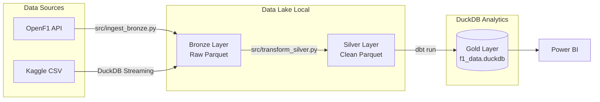

# 🏎️ F1 Analytics Pipeline 

Kompletní lokální datová pipeline postavená na nejmodernějším "Modern Data Stacku". Stahuje živá data F1 a historické výsledky, transformuje je přes Medallion architekturu (Bronze ➔ Silver ➔ Gold) a buduje plně optimalizovaný dimenzionální Star Schema model pro Power BI.

*Pro anglickou verzi, prosím přejděte na [README_EN.md](README_EN.md).*

## 🌟 Architektura a Technologie

- **Zdroje dat:**
  - **[OpenF1 API](https://openf1.org/):** Živá data ze sezóny 2025 (Sessions, Laps, Pit Stops, Telemetrie).
  - **Kaggle F1 Dataset (Ergast):** Historická data a dimenze (Okruhy, Jezdci, Výsledky).
- **Zpracování (Python 3.11+):**
  - Efektivní Extract & Load s využitím `requests.Session()` pro API a `DuckDB` streaming pro CSV.
  - Data lake postavený na kompresním formátu **Parquet**.
- **Transformace (dbt + DuckDB):**
  - **DuckDB** slouží jako in-process analytická databáze (Gold Layer), která čte přímo nad Parquet daty.
  - **dbt-core** s duckdb adaptérem se stará o transformace (dimenzionální model).



## 🚀 Jak spustit projekt lokálně

### 1. Příprava prostředí
Projekt vyžaduje Python 3.11+ a striktně definované verze v `requirements.txt`.
```bash
# Vytvoření virtuálního prostředí
python3 -m venv .venv
source .venv/bin/activate  # Na Windows: .venv\Scripts\activate

# Instalace závislostí
pip install -r requirements.txt
```

### 2. Spuštění pipeline
Pipeline je složená do 3 postupných kroků:
```bash
# KROK 1: Bronze Ingestion (Stáhne data z API a transformuje CSV přes DuckDB stream)
python src/ingest_bronze.py

# KROK 2: Silver Transformation (Vyčistí Parquet data a připraví je pro dbt)
python src/transform_silver.py

# KROK 3: Gold Transformation v dbt (Rozběhne SQL modely do f1_data.duckdb)
cd f1_dbt
dbt deps
dbt run
```

## 📊 Připojení k Power BI

Výstupem pipeline je soubor `f1_data.duckdb`. Aby mohl Power BI s DuckDB pracovat, potřebujete ODBC driver.

1. Stáhněte si nejnovější instalační soubor z [DuckDB GitHub repozitáře (ODBC relase)](https://github.com/duckdb/duckdb/releases) a nainstalujte.
2. Ve Windows spusťte **ODBC Data Sources (64-bit)**.
3. Přidejte připojení (DSN) pro **DuckDB Driver**, zadejte libovolný název (např. `F1_DuckDB_Source`) a vložte plnou cestu k vygenerovanému souboru `f1_data.duckdb`.
4. V Power BI Desktop zvolte **Získat data ➔ ODBC ➔ vyberte DSN `F1_DuckDB_Source`** a načtěte všechny `dim_*` a `fact_*` tabulky.

### 💡 Základní DAX Measures (míry)
```dax
Total Points = SUM('fact_race_results'[points])

Avg Lap Time Loss = AVERAGE('fact_lap_times'[time_loss])

Total Wins = CALCULATE(COUNTROWS('fact_race_results'), 'fact_race_results'[is_winner] = TRUE())
```
